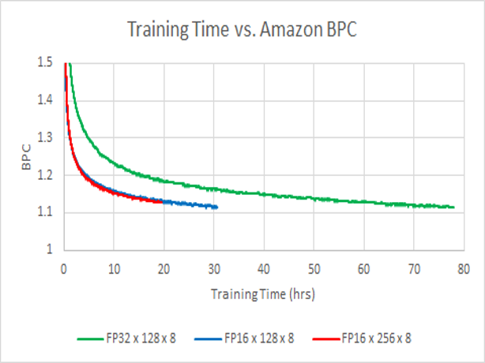
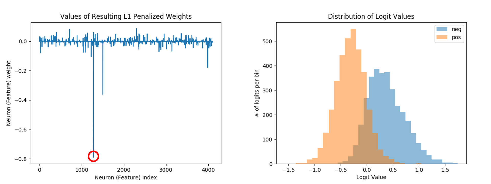
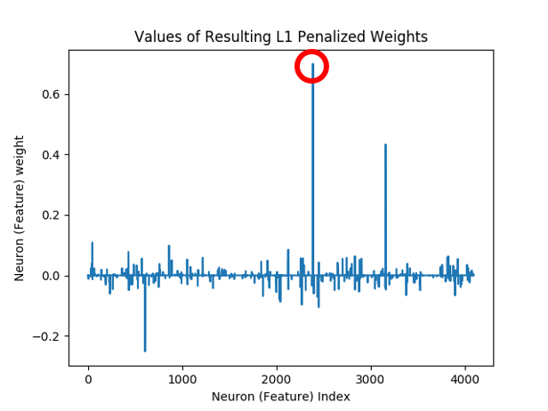

# PyTorch Unsupervised Sentiment Discovery
This codebase is part of our effort to reproduce, analyze, and scale the [Generating Reviews and Discovering Sentiment](https://github.com/openai/generating-reviews-discovering-sentiment) paper from OpenAI.

Using reduced precision FP16 arithmetic and tensorcore architecture, the model trains in **<1 day** on 8 volta-class gpus down from the training time of 1 month reported in the paper.



A byte-level (char-level) recurrent language model ([multiplicative LSTM](https://arxiv.org/abs/1609.07959)) for unsupervised modeling of large text datasets, such as the [amazon-review dataset](http://jmcauley.ucsd.edu/data/amazon/), is implemented in PyTorch. 

The learned language model can be transferred to other natural language processing (NLP) tasks where it is used to featurize text samples. The featurizations provide a strong initialization point for discriminative language tasks, and allow for competitive task performance given only a few labeled samples. To illustrate this the model is transferred to the [Binary Stanford Sentiment Treebank task](https://nlp.stanford.edu/sentiment/treebank.html).


The model's performance as a whole will increase as it processes more data. However, as is discovered early on in the training process, transferring the model to sentiment classification via Logistic Regression with an L1 penalty leads to the emergence of one neuron (feature) that correlates strongly with sentiment.

This sentiment neuron can be used to accurately and robustly discriminate between postive and negative sentiment given the single feature. A decision boundary of 0 is able to split the distribution of the neuron features into (relatively) distinct positive and negative sentiment clusters. 



Samples from the tails of the feature distribution correlate strongly with positive/negative sentiment.


## ReadMe Contents
 * [Setup](#setup)
   * [Install](#install)
   * [Pretrained Models](#pretrained-models)
   * [Data Downloads](#data-downloads)
 * [Usage](#usage)
   * [Classifying Text](#classifying-text)
     * [Classification Documentation](./script_docs/classifier.md)
   * [Training Language Models (+ Distributed/FP16 Training)](#training-language-models-distributed-fp16-training)
     * [Modeling Documentation](./script_docs/modeling.md)
     * [Training HyperParameter Documentation](./analysis/reproduction.md#training-set-up)
     * [FP16 Training Information](./analysis/reproduction.md#fp16-training)
   * [Sentiment Transfer](#sentiment-transfer)
     * [Transfer Documentation](./script_docs/transfer.md)
   * [Generation and Heatmap Visualization](#generation-and-heatmap-visualization)
     * [Generation Documentation](./script_docs/generation.md)
 * [Analysis](#analysis--)
    * [Why Unsupervised Language Modeling?](./analysis/unsupervised.md)
	   * [Difficulties of Supervised Natural Language](./analysis/unsupervised.md#difficulties-of-supervised-natural-language)
	   * [Data Robustness](./analysis/unsupervised.md#data-robustness)
	   * [Model/Optimization Robustness](./analysis/unsupervised.md#modeloptimization-robustness)
	* [Reproducing Results](./analysis/reproduction.md)
	   * [Training](./analysis/reproduction.md#training)
	      * [Training Setup](./analysis/reproduction.md#training-set-up)
	   * [FP16 Training](./analysis/reproduction.md#fp16-training)
	   * [Transfer](./analysis/reproduction.md#transfer)
	* [Data Parallel Scalability](./analysis/scale.md)
	   * [PyTorch + GIL](./analysis/scale.md#pytorch-gil)
	* [Open Questions](./analysis/questions.md)
 * [Acknowledgement](#acknowledgement)
 * [Thanks](#thanks)

## Setup
### Install
Install the sentiment_discovery package with `pip setup.py install` in order to run the modules/scripts within this repo.

### Python Requirements
At this time we only support python3.
 * numpy
 * pytorch (>= 0.4.0) (top of tree as of 3/13/2018)
 * pandas
 * scikit-learn
 * matplotlib
 * unidecode

### Pretrained models
We've included our trained 4096-d mlstm models in both fp16 and fp32:
 * [Binary SST](https://drive.google.com/file/d/1L91VBjGwYLnJmzzpdGb3x3pYrYkqPeby/view?usp=sharing) [329MB]
 * [Binary SST (FP16)](https://drive.google.com/file/d/1zwf5aZjy71LsTQD6t3Y5mfcINYqMj0VL/view?usp=sharing) [163MB]
 * [IMDB](https://drive.google.com/file/d/1kFclfuVVTYDwqa0s0_yGtls5HBHVt5uh/view?usp=sharing) [329MB]
 * [IMDB (FP16)](https://drive.google.com/file/d/1xWJRH18Z_E_aic80CdrAoXM1FsY_ZNfo/view?usp=sharing) [163MB]
 
Each file contains a PyTorch `state_dict` consisting of a language model (encoder+decoder keys) trained on Amazon reviews and a binary sentiment classifier (classifier key) trained with transfer learning on Binary SST/IMDB.

### Data Downloads
We've provided the Binary Stanford Sentiment Treebank (Binary SST) and IMDB Movie Review datasets as part of this repository. In order to train on the amazon dataset please download the "aggressively deduplicated data" version from Julian McAuley's original [site](http://jmcauley.ucsd.edu/data/amazon/). Access requests to the dataset should be approved instantly. While using the dataset make sure to load it with the `-loose_json` flag.

## Usage
In addition to providing easily reusable code of the core functionalities (models, distributed, fp16, etc.) of this work, we also provide scripts to perform the high-level functionalities of the original paper:
 * sentiment classification of input text
 * unsupervised reconstruction/language modeling of a corpus of text (+ script for launching distributed workers)
 * transfer of learned language model to perform sentiment analysis on a specified corpus
 * sampling from language model to generate text (possibly of fixed sentiment) + heatmap visualization of sentiment in text

<!--Script results will be saved/logged to the `<experiment_dir>/<experiment_name>/*` directory hierarchy.-->

### Classifying text
Classify an input csv/json using one of our pretrained models or your own.
Performs classification on Binary SST by default.
Output classification probabilities are saved to a `.npy` file

```
python3 classifier.py --load_model ama_sst.pt                           # classify Binary SST
python3 classifier.py --load_model ama_sst_16.pt --fp16                 # run classification in fp16
python3 classifier.py --load_model ama_sst.pt --data <path_to_data.csv>     # classify your own dataset
```

See [here](./script_docs/classifier.md) for more documentation.

### Training Language Models (+ Distributed/FP16 Training)
Train a recurrent language model on a csv/json corpus. By default we train a weight-normalized, 4096-d mLSTM, with a 64-d character embedding.
This is the first step of a 2-step process to training your own sentiment classifier.
Saves model to `lang_model.pt` by default.

```
python3 main.py                                                               #train a large model on imdb
python3 main.py --model LSTM --nhid 512                                       #train a small LSTM instead
python3 main.py --fp16 --dynamic_loss_scale                                   #train a model with fp16
python3 -m multiproc main.py                                                  #distributed model training
python3 main.py --data .data/amazon/reviews.json --lazy --loose_json \        #train a model on amazon data
--text_key reviewText --label_key overall --num_shards 1002 \
--optim Adam --split 1000,1,1  
```

For more documentation of our language modeling functionality look [here](./script_docs/modeling.md)

In order to appropriately set the learning rate for a given batch size see the [training reproduction](./analysis/reproduction.md#training-set-up) section in analysis.

For information about how we achieve numerical stability with FP16 training see our [fp16 training](./analysis/reproduction.md#fp16-training) analysis.

### Sentiment Transfer
Given a trained language model, this script will featurize text from train, val, and test csv/json's.
It then uses sklearn logistic regression to fit a classifier to predict sentiment from these features.
Lastly it performs feature selection to try and fit a regression model to the top n most relevant neurons (features).
By default only one neuron is used for this second regression.

```
python3 transfer.py --load_model <model>.pt                               #performs transfer to SST, saves results to `<model>_transfer/` directory
python3 transfer.py --load_model <model>.pt --neurons 5                   #use 5 neurons for the second regression
python3 transfer.py --load_model <model>.pt --fp16                        #run model in fp16 for featurization step
```

Below is sample output from a fully trained model on Binary SST.

```
all neuron regression took 26.882004499435425 seconds
92.3121387283237, 92.66055045871559, 91.70785282811642 train, val, test accuracy for all neuron regression
0.25 regularization coefficient used
146 features used in all neuron regression

using neuron(s) 2388 as features for regression
1 neuron regression took 0.05171680450439453 seconds
88.42485549132948, 89.3348623853211, 88.5227896760022 train, val, test accuracy for 1 neuron regression
0.03125 regularization coefficient used
```

Additional documentation of the command line arguments available for transfer can be found [here](./script_docs/transfer.md)

### Generation and HeatMap Visualization
The basic functionality generates text up to a specified number of tokens given a trained language model.

```
python generate.py --load_model <path2classifier.pt>t --gen_length 1000      #generates 1000-token long text from a given model
```

Beyond that, this script can also be used to analyze activation heatmaps of a particular sentiment neuron given a trained AND transfered language model.

By default the maximally contributing neuron during past regression transfers is used to generate these heatmaps (as seen below)



This neuron leads to the following heatmap for text about Sean Connery.

```
python3 generate.py --load_model <path2classifier.pt> --gen_length -1 --heatmap \         # model does no text generation, only text analysis and heatmap generation 
--text "25 August 2003 League of Extraordinary Gentlemen: Sean Connery is one of \
the all time greats I have been a fan of his since the 1950's."  
```


In addition to analysis, one can use a piece of text as an initial context to warm up the model for generation.

```
python3 generate.py --load_model <path2classifier.pt> --gen_length 200 --heatmap \         # model runs for 200 tokens total including generated and warm up tokens
--text "25 August 2003 League of Extraordinary Gentlemen: Sean Connery is "
```


In addition to generating text, the user can also set the sentiment of the generated text to positive/negative by setting `-overwrite` to +/- 1. Continuing our previous example:


When training a sentiment neuron with this method, sometimes we learn a positive sentiment neuron, and sometimes a negative sentiment neuron. This doesn’t matter, except for when running the visualization. The `negate` flag improves the visualization of negative sentiment models, if you happen to learn one.

```
python3 generate.py --load_model <path2classifier.pt> --gen_length 200 --heatmap \
-text "25 August 2003 League of Extraordinary Gentlemen: Sean Connery is" \
-overwrite +/-1
```


More documentation on text generation and heatmap analysis is available [here](./script_docs/generate.md)
 
## [Analysis](./analysis/)
 * [Why Unsupervised Language Modeling?](./analysis/unsupervised.md)
   * [Difficulties of Supervised Natural Language](./analysis/unsupervised.md#difficulties-of-supervised-natural-language)
   * [Data Robustness](./analysis/unsupervised.md#data-robustness)
   * [Model/Optimization Robustness](./analysis/unsupervised.md#modeloptimization-robustness)
 * [Reproducing Results](./analysis/reproduction.md)
   * [Training](./analysis/reproduction.md#training)
     * [Training Setup](./analysis/reproduction.md#training-set-up)
   * [FP16 Training](./analysis/reproduction.md#fp16-training) 
   * [Transfer](./analysis/reproduction.md#transfer)
 * [Data Parallel Scalability](./analysis/scale.md)
   * [PyTorch + GIL](./analysis/scale.md#pytorch-gil)
 * [Open Questions](./analysis/questions.md)

## Acknowledgement
A special thanks to [@csarofeen](https://github.com/csarofeen) and [@Michael Carilli](https://github.com/mcarilli) for their help developing and documenting our RNN interface, fused kernels, and fp16 optimizer.

Thanks to [@guillitte](https://github.com/guillitte) for providing a lightweight pytorch [port](https://github.com/guillitte/pytorch-sentiment-neuron) of openai's weights for benchmarking our models.

This project uses the [amazon review dataset](http://jmcauley.ucsd.edu/data/amazon/) collected by J. McAuley


## Thanks
Want to help out? Open up an issue with questions/suggestions or pull requests ranging from minor fixes to new functionality.

**May your learning be Deep and Unsupervised.**
