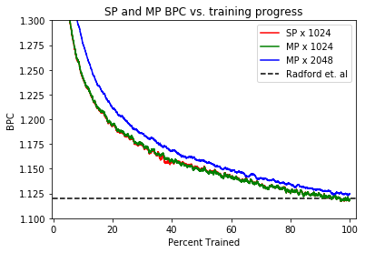
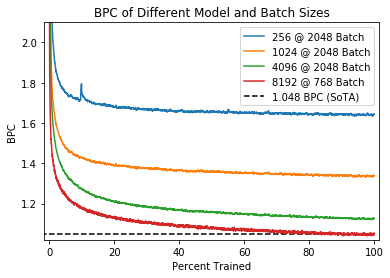

# Reproducing Results
This repo started by trying to reproduce results from OpenAI's [Learning to Generate Reviews and Discovering Sentiment](https://arxiv.org/abs/1704.01444) work, and it has since evolved to include more complex language models, methods of tokenization, and classification problems. 

Our original reproduction achieved comparable results in both unsupervised reconstruction and sentiment transfer. This is denoted by solid lines for our model and dashed lines for OpenAI's model. We used weights sourced from OpenAI to manually verify performance on our instance of the data.


## Training 
Contrary to results in the OpenAI work the validation reconstruction loss is lower than the training loss. However, we found that the downstream classification performance was comparable so we consider our implementation to be of satisfactory performance and relatively equivalent.

### mLSTM Training Set Up
It took several cycles of trial and error to come up with a result comparable to the original. Some things were not entirely apparent from the paper, key model details were often hidden in one line, and took several tries to get right. Other minutia were found out independently. We've included what we found to work well.
 * **Model**: 4096-d mLSTM, 64-d embedding, 256-d output. (we also trained a similarly parameterized lstm)
 * **Weight Norm**: Applied only to lstm parameters (hidden->hidden/gate weights), not embedding or output. 
 * **Optimizer**: Adam
 * **Learning Rate**: 5e-4 per batch of 128. Linear Learning rate decay to 0 over course of epoch.
 * **Gradient Clipping**: We occassionally ran into problems with destabilizing gradient explosions. Therfore, we clipped our gradients to a maximum of `1.`.
 * **Data set**: Aggressively Deduplicated Amazon Review dataset with 1000/1/1 train/test/validation shards. Each of the three sets are internally shuffled. Samples in a shard are concatenated together so as to persist state across gradient updates.
   * **Tokenization**: Character level tokenization was used. Including padding tokens this resulted in a vocabulary size of 257
   * **Sequence Length**: Sequences of 256 tokens were used
 * **State Persistence**: The hidden state is persisted across all samples and reset at the start of a shard.
 * **Batch per gpu**: 128 (instead of OpenAI's 32) with FP32 training and 256 with FP16 training.
 * **Hardware**: 8 volta-class gpus
 * **Learning Rate Scaling**: We took queues from recent work in training imagenet at scale and leveraged [FAIR's (Goyal et. al 2017)](https://arxiv.org/pdf/1706.02677.pdf) linear scaling rule.  However, after sufficient experimentation we found that learning rate scaling did not work well at all batch sizes and we capped our max learning rate at 3e-3. We also found that using a linear decay rate over 100k steps for global batch sizes greater than 2048 worked well in our case.
 * **Training Time**: With FP16 training it takes approximately 17 hours to train.
 * **Training command**: To run this training experiment run `./experiments/train_mlstm_singlenode.sh`.

### Transformer Training Set Up
The transformer model has demonstrated its capabilities in recent work as a state of the art language model for natural language understanding. We similarly leveraged the transformer in our work on [Practical Text Classification With Large Pre-Trained Language Models](https://arxiv.org/abs/1812.01207). The transformer we used was pre trained as follows.
 * **Model**: Transformer with 12 layers, 8 attention heads, hidden size of 768, and an embedding size of 3072. Positional embeddings up to length 256 were used.
 * **Weight Norm**: Applied only to transformer and output head parameters, not embedding parameters. 
 * **Optimizer**: Adam
 * **Learning Rate**: 1e-4 with cosine annealing schedule
 * **Data set**: Aggressively Deduplicated Amazon Review dataset with 1000/1/1 train/test/validation shards. Each of the three sets are internally shuffled.
   * **Tokenization**: We used a sentencepiece tokenization with a vocab size of 32k. Including padding tokens this resulted in a total vocabulary size of 32001.
   * **Sequence Length**: Sequences of 64 tokens were used. We found that pretraining on shorter sequences led to better downstream tweet classification performance.
 * **Batch per gpu**: 32
 * **Hardware**: 1 DGX-1V with 8 V100 GPUs
 * **Learning rate Scaling**: In our experiences we found that learning rate scaling as a function of available compute did not help train our transformer, and that a learning rate of 1e-4 across all global batch sizes was simple and performed well.
 * **Training time**: With FP16 training it takes approximately 3 days to train.
 * **Training command**: To run this training experiment run `./experiments/train_transformer_singlenode.sh`.


## FP16 Training
Training our models with FP16 arithmetic has proven to be critical for improving turnaround time of our own experiments and the speed of ideation. In addition to faster computation, with FP16 training we're also able to utilize a batch size that is at least 2x larger compared to FP32 training with no significant computation slowdown. This allows for an additional 2x speedup in training on top of the faster arithmetic.

However, as is often the case with reduced-precision training, training convergence and numeric instability/lack of dynamic range is a concern.

In order to address numeric instability in training we used several techniques that we deemed necessary:
 * **Dynamic loss scaling**: We utilized [dynamic loss scaling's](https://docs.nvidia.com/deeplearning/sdk/mixed-precision-training/index.html#scalefactor) (from [Micikevicius et. al](https://arxiv.org/abs/1710.03740)) iterative approach to find a scaling constant for the gradients so that  small gradients do not underflow and important numerical information is not lost during training time.
 * **FP32 Master Params**: We keep a copy of our FP16 parameters in FP32 for accumulating gradient updates. This presents minimal additional compute overhead as elementwise additions are relatively fast in fp32. Furthermore, these FP32 parameters can also be kept on cpu to not consume additional memory.
 * **FP32 Softmax CrossEntropy**: In order to overcome the harsh exponentiation and numerical instability in the softmax operation. We found it necessary to use intermediary FP32 logits when calculating our loss. (The final linear multiplication to get these logits is still done in fp16)
 
We also establish other best practices that did not directly affect our results, but address other possible sources of numeric instability that may arise while training:
 * **FP32 loss reduction**: Any reduction/averaging of more than 65k terms will be met with a dynamic range problem, so we convert any loss scalars to float as a relatively inexpensive safety measure.
 * **FP32 normalization**: Any l2 norm greater than 256 will have a dynamic range problem while computing the norm. As such, one should exponentiate and accumulate values into FP32 before returning the final norm in FP16.

Using these techniques we are able to achieve convergence numbers for mLSTM training in fp32 (SP) and fp16 (MP) that are comparable to [Radford et. al's results](https://arxiv.org/abs/1704.01444) as demonstrated below. To train a model with the same speed numbers reported in our (large batch training)[https://nv-adlr.github.io/publication/2018-large-batch-lm] work, please use an older version of our [repository](https://github.com/NVIDIA/sentiment-discovery/tree/7f5ab28918a6fc29318a30f557b9454f0f5cc26a#pretrained-models).



## Going Bigger with Large Models
We also analyzed the effect of various mLSTM model sizes on performance.

We utilize FP16's increased speed and reduced memory footprint to train a model with a hidden state size of 8k.

This allows us to further improve on the State of The Art BPC on Amazon Review language modeling and sentiment classification.

 

## Transfer
We chose to reproduce transfer results from [Radford et al's work](https://arxiv.org/abs/1704.01444) with the binary Stanford Sentiment Treebank dataset as opposed to the IMDB dataset because of its smaller size, and faster turnaround time for experiments.

Data samples are featurized by running a forward pass of the model over the data and extracting the cell (not hidden) state from the last token. 

These features are used for training a logistic regression model (via sklearn/PyTorch) against the samples' associated labels. We use classification performance on a hold out validation set to select an L1 regularization hyperparameter. 

The feature with the largest L1 penalty is then treated as a "sentiment neuron" to classify the samples and analyze difference in performance.

To run this type of transfer learning use:
```
bash ./experiments/run_sk_sst.sh                                    #run transfer learning with mlstm on imdb dataset
bash ./experiments/run_sk_imdb.sh                                   #run transfer learning with mlstm on sst dataset
```

**It should be noted that SOTA performance uses [Gray et. al's](https://blog.openai.com/block-sparse-gpu-kernels/) follow up work for comparison**


## Finetuning Classifiers
Not only can we transfer models to downstream classification tasks, but we can also perform end to end finetuning of models on difficult downstream text classification tasks. In our latest [work](https://arxiv.org/abs/1812.01207) we finetune Transformer and mLSTM language models on the [SemEval 2018 1 E-c tweet emotion classification challenge](https://competitions.codalab.org/competitions/17751). 

Since no test set is available we report our numbers on the validation set. To reproduce these numbers please run the command `./experiments/run_se_singlehead.sh` to reproduce our results with single head classification models and command `./experiments/run_se_multihead.sh` to reproduce our results with multi head classification.

Results should line up approximately with below.


## ELMo Comparison
To analyze how our pretraining, transfer, and finetuning methods stack up to other state of the art models and techniques we utilize the publicly available ELMo language model as a baseline. In order to reproduce our results with ELMo please switch to the [ELMo branch](https://github.com/NVIDIA/sentiment-discovery/tree/elmo).

To train a text classifier with ELMo we utilize ELMo as a language model to encode text whose features are passed to a classifier. The classifier can either be a simple linear layer or a more complex multilayer perceptron. The training can either be performed with end to end training of the classifier and language model, or in a transfer learning setting with only the classifier being trained via logistic regression or SGD.

The following training scripts are capable of reproducing our results with ELMo on SST and the SemEval benchmark challenge. In order to run these scripts you must follow the installation instructions in AllenNLP's [ELMo repository](https://github.com/allenai/allennlp/blob/master/tutorials/how_to/elmo.md). Note that for finetuning we did not use an auxliary language modeling loss as ELMo is bidirectional and cannot perform Left to Right language modeling normally. 

```
bash ./run_elmo_sk_sst.sh 								#trains a logistic regression classifier on SST with ELMo
bash ./run_elmo_se_multihead.sh                         #end to end finetuning of ELMo and a multihead MLP on 8 SemEval categories
```

------

[<- Why Unsupervised Language Modeling?](./unsupervised.md) | [Data Parallel Scalability ->](./scale.md)